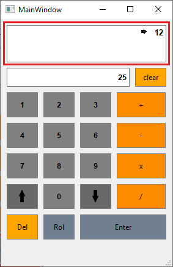
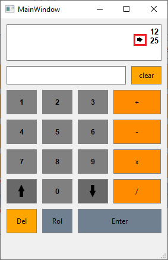

# RPN-Calculator:

 

### About this project: 

This is  a first  try of my to create a  open source program, and I got inspiration from a task that I had done at college.

This is a basic  calculator based on **Reverse Polish Notation** (RPN) mode or simply  **postfix notation**, and it means that  which operators follow their operands. 

In this mathematical notation, for example, to add  6 and 7 ,  would write  6 7 +,  instead of 6 + 7. In the situation that you have more than one operation you could do the following: 

**Conventional way:** 6 + 7 - 2, that results in 11

**RPN notation:** 6 7 + 2 - (first 6 and 7 will be added together and then will be subtracted from 2), also result in 11; Or 6 7 2 - + (first 7 will be subtracted from 2 and then added  6), also results in 11.

Another  useful example:

**Conventional way:** 6 + 7 * 2 or 6  + (7 * 2) that results in 20. Although, it would be quite different if it was written (6 + 7) * 2 that results in 26.

**RPN notation:** 6 7 2 * +, result in 20. Or 6  7 + 2 * that result in 26

## Why?

The reason why I decided to do this is because I want to create a portfolio and I thought that it might be a good idea to start with this one. It would  help me to learn the basic concepts of Git and GitHub. Also, I would like to show my current ability with programming and improvements that will happen.

Nevertheless, I would like to you to keep in contact to tell me what did you think about this project and if you have any suggestions.

LinkedIn: https://www.linkedin.com/in/krystian-keller-a88b001a4/

Email: krystiankeller2@gmail.com 

 

## Observation:

1 - This calculator does not make decimal math operations, the results need to be in the Natural Numbers. If this won't happen the result will be rounded.

2- For this project, the user can not type the numbers, the only way to put the numbers into the input section is by clicking the buttons disposed;

## Installer:

You can download and try this Calculator by [clicking here](https://github.com/Krystian-Keller/RPN-Calculator/raw/main/RPN_Calculator_Installer.exe).

## Functionalities:

- ##### Numbers Buttons:

  - We can only make inputs by using this following buttons highlighted. 

     

   

  * The Numbers that you clicked should appear at here: 
  
     

* ##### Enter Function:

  * Once that you had already put the numbers into the input label, you must clicked the **Enter** button to allocate in the Calculator's memory and the operand will appear in the output label.

      

  * According to the order that you put the operands, will appear an **Indicative Arrow** in the output label.

     

* ##### Math Operations: 

  * The four basic math operations is disposed above:

     

  * For this example, I clicked in the **Addition** Button: 

     
  
* ##### Clear and Del Functions:

  * The Clear Button function is to only **clear** the input label;
  
  * Del function is to **clear all the memory** of the calculator and allow you to reuse the Program without restarting it;

* ##### Rol Function:

  * The Rol button is meant to change the operands place with wich others, only can use the last two operands;

     

* ##### Arrow Function:

  * In the case that you have a lot of operands in the memory, the output label may can't show all of them. So, for this reason, the arrows would help you to swipe up and down through the display.

      

     

    
